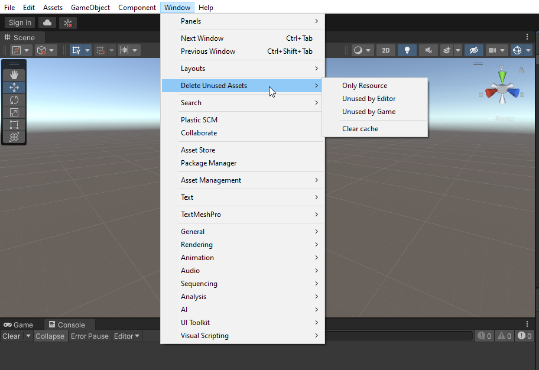
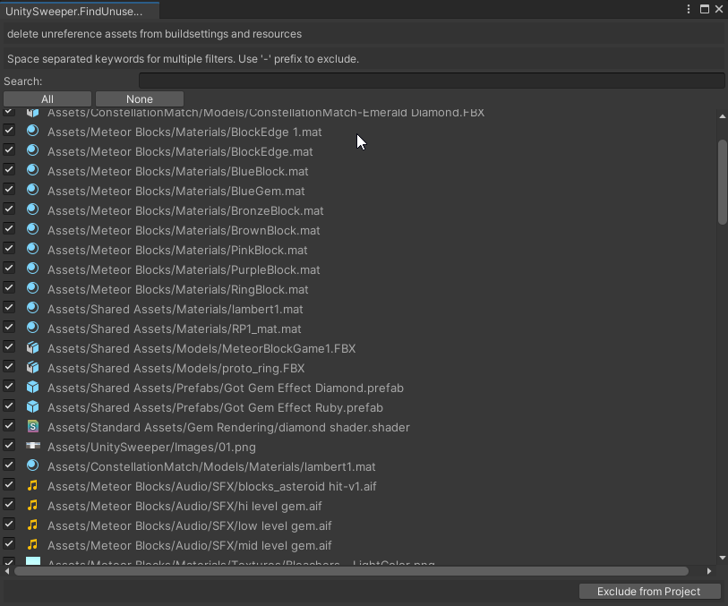
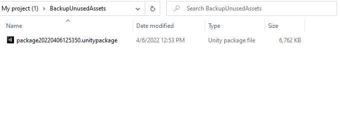

# Installation

Copy the folder "UnitySweeper/Editor" of this project into the "plugins" folder, under the assets folder of your Unity project.

The path should look like this: "Assets/Plugins/UnitySweeper/Editor".

# Unity Sweeper

This plugin helps you sweep up your project - it detects unused files, removes them from the project, and creates a backup of the removed assets exported as a unity package.

Using the tool is really simple. You can initiate deleting unused files through the `Window` menu.

Options are:
* _Only resource_ - Will sweep everything except scripts
* _Unused by Editor_ - Will sweep everything used by game or editor, including scripts
* _Unused by Game_ - Will sweep everything used by game, including scripts
* _Clear cache_ - Deletes cache files

If you choose any of first three options, Unity Sweeper will run a search through your project, after which it will show a screen like this:

...from where you can review the unused assets found, uncheck assets which you want to keep in your project, and select the assets you want to exclude from your project. Unity Sweeper will also remove empty directories. 

Clicking the _Exclude from Project_ button will create a Unity Package with current the datetime and export the package to the location of `PROJECT_ROOT/BackupUnusedAssets`.

Enjoy!

---------------------

The first (but since abandoned) version of this tool was built by [tsubaki](https://github.com/tsubaki).
